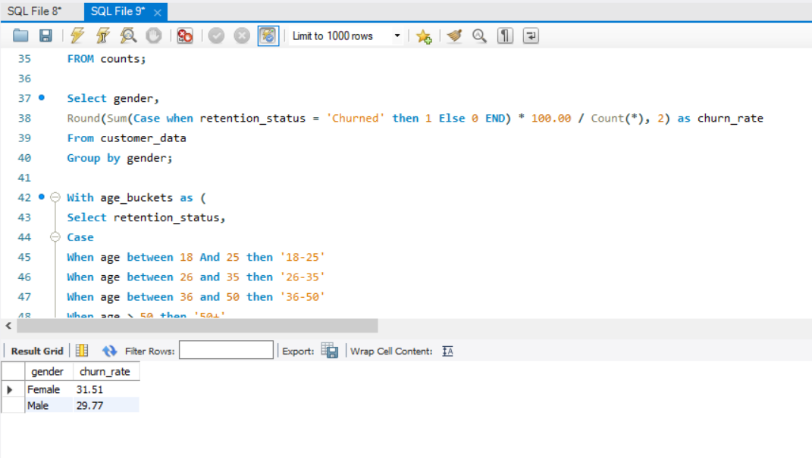
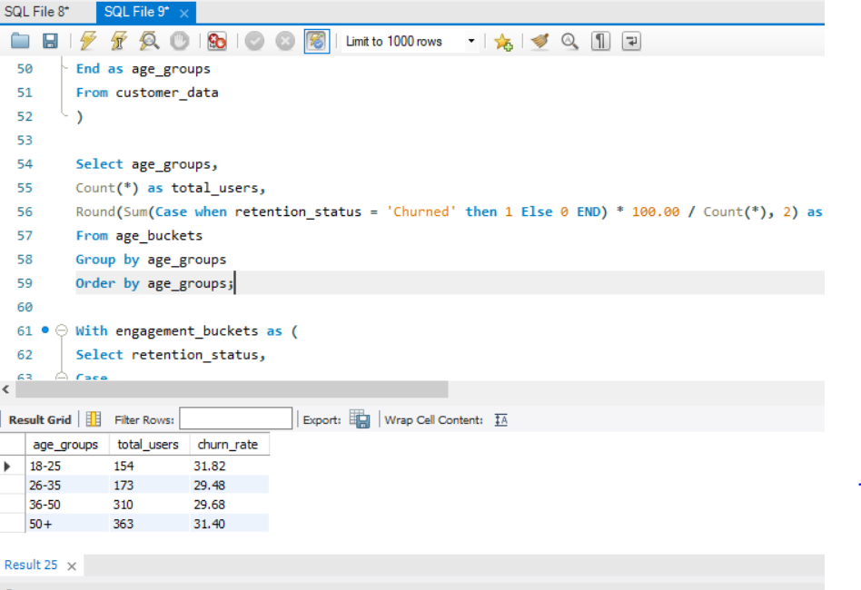
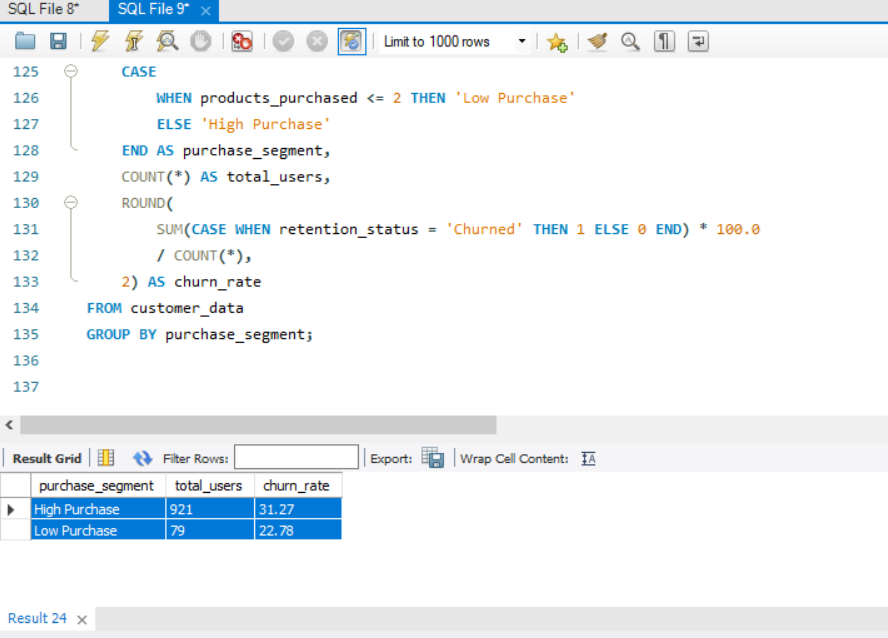

## Churn by Gender

- Female churn slightly higher than male

## Churn by Age(groups)

- Age group of 18-25 highest churn, however it is relatively very small in difference among the rest of the age groups

##Churn by Purchasing Pattern

-Users with higher purchases showed a moderately higher churn rate (~31%) compared to low purchase users (~23%).
